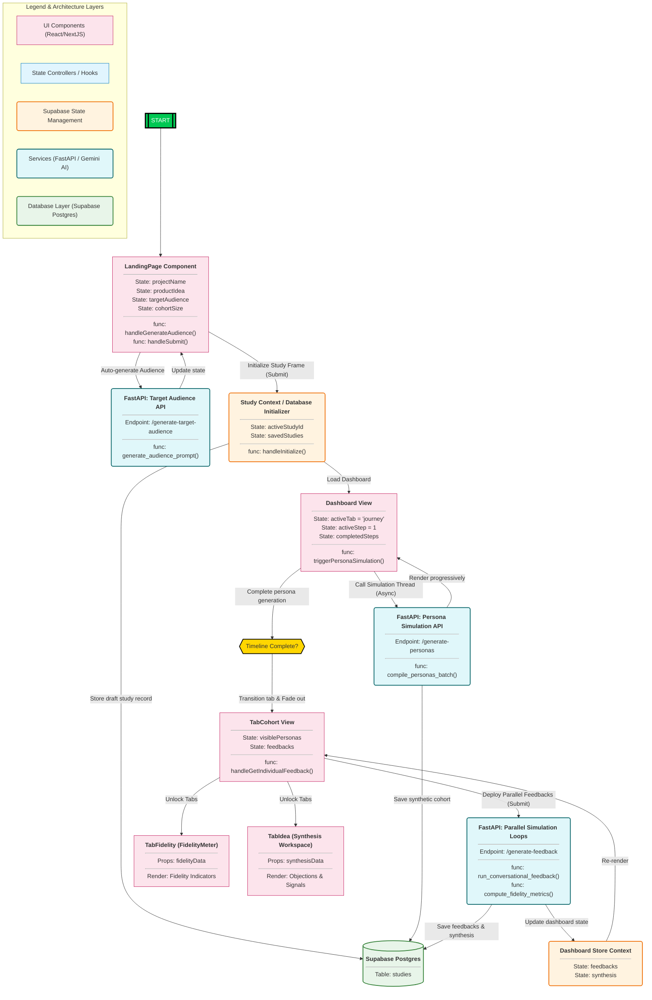

# 🔮 SynthIQ

<p align="center">
  
</p>

<p align="center" style="font-size: 20px; font-weight: 600; color: #a855f7; margin-top: 15px; margin-bottom: 25px;">
  <b>Stop guessing, Start Validating.</b>
</p>

---

## 💡 The Problem

Building new products is a high-stakes gamble. Traditionally, validating a product idea or finding product-market fit is broken:

*   **Extremely Slow & Costly:** Recruiting, scheduling, and conducting dozens of real customer interviews takes weeks and drains thousands of dollars.
*   **Politeness Bias:** Real interviewees often suffer from *courtesy bias*—they tell you what you want to hear instead of giving you harsh, realistic objections.
*   **Gut-Feeling Engineering:** Developers and product managers build full features based on sheer guesswork, only to discover post-launch that no one actually wants them.

---

## 🚀 The Solution

**SynthIQ** is a premium, AI-powered customer simulation engine. It allows product teams to test any product idea in **5 minutes** by generating hyper-realistic, psychographically precise synthetic customer cohorts that mimic real market behavior.

*   **Zero Wait-Time Validation:** Input any idea, auto-generate your exact market demographic, and spin up an active cohort of interactive customer personas.
*   **Parallel Feedback Simulations:** Run automated conversational interviews and custom multiple-choice questionnaires across all personas simultaneously.
*   **High-Fidelity Synthesis:** Receive granular validation metrics, objection clusters grouped by frequency, purchase likelihood scores, and a mathematically calculated research quality score (**Fidelity Meter**).

---

## 🗺️ How It Works (Step-by-Step)

SynthIQ is designed to feel responsive, premium, and alive. Each step of the validation workflow features responsive micro-animations (like real-time ghost typing, a walking loader silhouette, and canvas-rendered personas) to guide users seamlessly.

### Step 1: Initialize Your Study Framework

> [!TIP]
> *Stop staring at a blank slate.* Use our built-in AI auto-generator to define your market demographic instantly.

Input your project name, problem statement, and let the background FastAPIs frame your target audience. A live counter displays active validation studies happening in real-time.

```
+-------------------------------------------------------------+
|  Project Name:  [ Smart Grocery App                      ]  |
|  Product Idea:  [ AI app that builds a grocery list...   ]  |
|  Target Market: [ Busy parents aged 30-45 wanting health ]  |
+-------------------------------------------------------------+
```

<p align="center">
  
  <br/>
  <i>(Placeholder: Place screenshot here showing the clean setup card and AI target audience generator)</i>
</p>

---

### Step 2: Compile the Customer Cohort

Once initialized, watch your synthetic customer personas compile in real-time. A progressive timeline overlay maps out cohort architecture as virtual profiles populate the background.

*   **Deep Psychological Profiles:** Each customer receives a unique name, age, occupation, relationship with money, dealbreakers, and a fully computed **OCEAN psychographic profile** (Openness, Conscientiousness, Extraversion, Agreeableness, Neuroticism).

<p align="center">
  
  <br/>
  <i>(Placeholder: Place screenshot here showing the dynamic timeline and the live persona card grid)</i>
</p>

---

### Step 3: Deploy Parallel Conversational Simulations

Deploy parallel feedback simulation threads. SynthIQ chats with every persona in the background, conducting interactive interviews and customizable multiple-choice questionnaires tailored to your product space.

*   **No Courtesy Bias:** Synthetic users challenge your assumptions with brutal honesty. See their exact purchase likelihood, dealbreakers, and pricing sensitivity.

```
   [Persona: Marcus Vance, 34 (Architect)]
   💬 "I won't use this if it takes more than 1 minute to scan my fridge. My time is tight."
   🛒 Purchase Likelihood: 35%  |  💰 Price Reaction: Too Expensive
```

<p align="center">
  
  <br/>
  <i>(Placeholder: Place screenshot here showing simulated interview dialogue and multiple-choice answers)</i>
</p>

---

### Step 4: High-Fidelity Validation Synthesis

SynthIQ compiles the entire study into a sleek, actionable executive dashboard, allowing you to instantly assess viability:

*   **The Fidelity Meter:** A multi-dimensional progress indicator grading the research quality based on *cohort diversity*, *profile validation*, and *argumentative consistency*.
*   **Objection Clusters:** Automatically identifies and aggregates key customer friction themes, ranked by frequency.
*   **Surprising Outliers:** Isolates unexpected behaviors or insights that contradict the mainstream demographic consensus.
*   **Positive Signals & Critical Risks:** Distills immediate features you *must build* and dealbreakers that *will fail*.

<p align="center">
  
  <br/>
  <i>(Placeholder: Place screenshot here showing the Fidelity Score badge, Objection Clusters, and the full executive summary)</i>
</p>

---

## 🛠️ Architecture & Under the Hood

SynthIQ is engineered with a high-performance modern tech stack. The UI handles active state and dynamic progress rendering seamlessly, communicating with a parallelized Python FastAPI backend.

Below is the complete execution and state workflow of the SynthIQ simulation:



---

## ⚡ Setup & Installation

### 1. Backend Setup (FastAPI)
```bash
cd backend
# Create and activate virtual environment
python3 -m venv venv
source venv/bin/activate
# Install dependencies
pip install -r requirements.txt
# Run service
uvicorn main:app --reload --port 8000
```

### 2. Frontend Setup (Next.js)
```bash
cd synthetic-customer-frontend
# Install packages
npm install
# Run developer environment
npm run dev
```

Open [http://localhost:3000](http://localhost:3000) to see SynthIQ in action!
